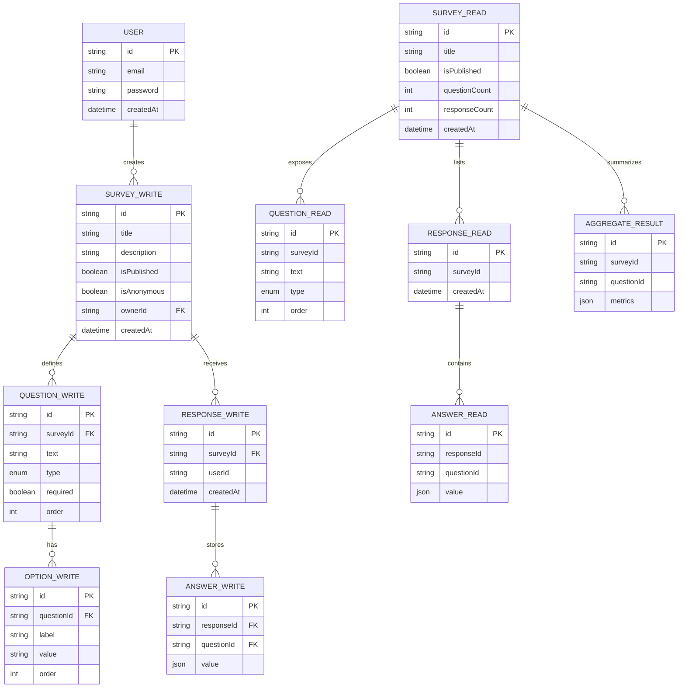

```mermaid
erDiagram
    %% =====================
    %% WRITE MODEL (COMMAND)
    %% =====================

    USER {
        string id PK
        string email
        string password
        datetime createdAt
    }

    SURVEY_WRITE {
        string id PK
        string title
        string description
        boolean isPublished
        boolean isAnonymous
        string ownerId FK
        datetime createdAt
    }

    QUESTION_WRITE {
        string id PK
        string surveyId FK
        string text
        enum type
        boolean required
        int order
    }

    OPTION_WRITE {
        string id PK
        string questionId FK
        string label
        string value
        int order
    }

    RESPONSE_WRITE {
        string id PK
        string surveyId FK
        string userId
        datetime createdAt
    }

    ANSWER_WRITE {
        string id PK
        string responseId FK
        string questionId FK
        json value
    }

    %% =====================
    %% READ MODEL (QUERY)
    %% =====================

    SURVEY_READ {
        string id PK
        string title
        boolean isPublished
        int questionCount
        int responseCount
        datetime createdAt
    }

    QUESTION_READ {
        string id PK
        string surveyId
        string text
        enum type
        int order
    }

    RESPONSE_READ {
        string id PK
        string surveyId
        datetime createdAt
    }

    ANSWER_READ {
        string id PK
        string responseId
        string questionId
        json value
    }

    AGGREGATE_RESULT {
        string id PK
        string surveyId
        string questionId
        json metrics
    }

    %% =====================
    %% RELATIONS
    %% =====================

    USER ||--o{ SURVEY_WRITE : creates
    SURVEY_WRITE ||--o{ QUESTION_WRITE : defines
    QUESTION_WRITE ||--o{ OPTION_WRITE : has
    SURVEY_WRITE ||--o{ RESPONSE_WRITE : receives
    RESPONSE_WRITE ||--o{ ANSWER_WRITE : stores

    SURVEY_READ ||--o{ QUESTION_READ : exposes
    SURVEY_READ ||--o{ RESPONSE_READ : lists
    RESPONSE_READ ||--o{ ANSWER_READ : contains
    SURVEY_READ ||--o{ AGGREGATE_RESULT : summarizes

```
